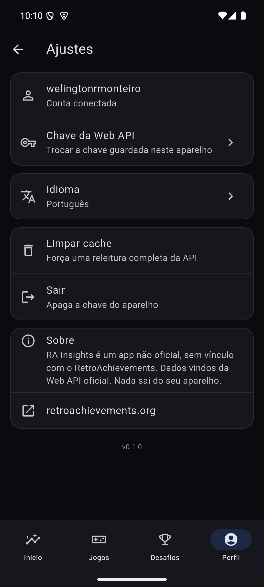

# Ajustes

Acessível pela engrenagem no topo do [Perfil](Perfil.md). Tela pequena de
propósito — o app não tem nada para configurar além do que está aqui.

- **Conta conectada** — mostra o nome de usuário logado.
- **Chave da Web API** — troca a chave guardada neste aparelho sem precisar
  sair e logar de novo. A chave fica em `flutter_secure_storage`
  (`EncryptedSharedPreferences`/Android Keystore), nunca em texto puro.
- **Idioma** — Português ou Inglês, seguindo `flutter_localizations` +
  gen-l10n; troca sem reiniciar o app.
- **Limpar cache** — força uma releitura completa da API, descartando tudo
  que está no SQLite local. Útil quando um dado parece desatualizado mesmo
  depois de um "puxar para atualizar".
- **Sair** — apaga a chave guardada no aparelho. Como não existe servidor,
  isso é literalmente tudo que "sair" precisa fazer: não há sessão remota
  para encerrar.
- **Sobre** — reafirma que o app é **não oficial**, sem vínculo com o
  RetroAchievements, que os dados vêm da Web API oficial e que nada sai do
  aparelho além do necessário para autenticar essas chamadas. Link direto
  para retroachievements.org.
- **Versão** — número da build, no rodapé.

---
Anterior: [Busca e Jogadores](Busca-e-Jogadores.md) · [Home](Home.md)
