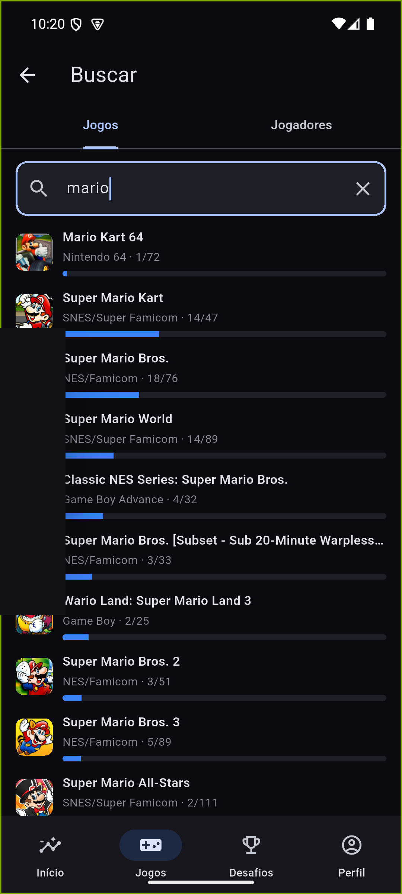
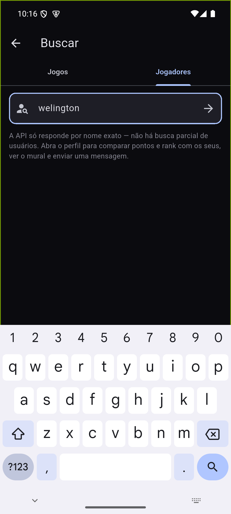
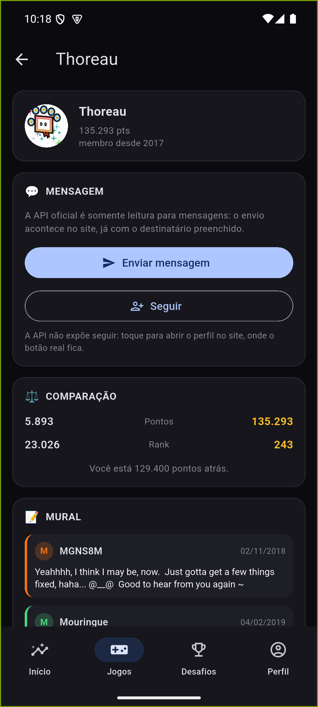

# Busca e Jogadores

Acessível pelo ícone de lupa no topo da aba **Jogos**. Duas abas, porque as
duas buscas funcionam de formas fundamentalmente diferentes — vale deixar
isso visível em vez de fingir que são a mesma caixa de texto.

## Aba Jogos

Busca **local, offline**, dentro dos jogos que você já jogou — não é um
catálogo do RetroAchievements inteiro, porque **a Web API não expõe busca no
catálogo completo**. O aviso na tela existe justamente para não deixar a
pessoa esperando um resultado que a API não tem como entregar.

## Aba Jogadores

Aqui a limitação é o oposto: a API só responde por **nome exato** — não existe
busca parcial de usuário (digitar "welington" não retorna
"welingtonrmonteiro"). A tela avisa isso na hora, para a pessoa saber que
precisa do nome de usuário certinho.

## Perfil de outro jogador

Depois de encontrar o nome exato, a ficha mostra:

- **Enviar mensagem** — a API oficial é somente leitura para mensagens; o
  botão abre o site já com o destinatário preenchido, porque enviar de fato
  só é possível por lá.
- **Seguir** — a Web API **não expõe** seguir/deixar de seguir. O botão abre o
  perfil no site, onde a ação de verdade existe; o texto abaixo dele deixa
  esse limite explícito em vez de fingir que o app segue por conta própria.
- **Comparação** — seus pontos e rank lado a lado com os da outra pessoa, e
  quantos pontos separam vocês dois.
- **Mural** — os comentários do mural *dela*, com o mesmo componente de link
  incorporado (YouTube, imagens) usado no seu próprio [Perfil](Perfil.md).

---
Próxima: [Ajustes](Ajustes.md) · Anterior: [Perfil](Perfil.md) · [Home](Home.md)
