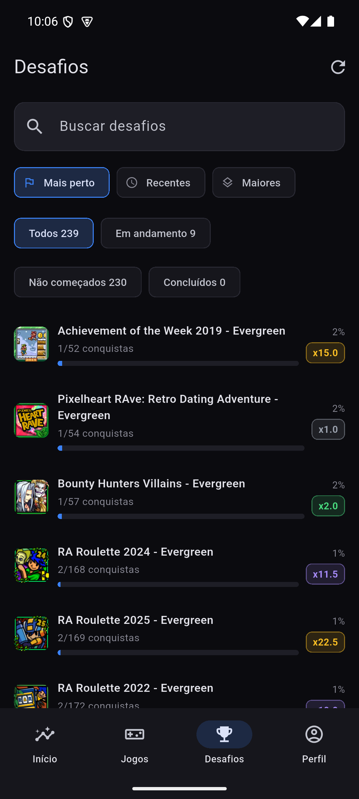
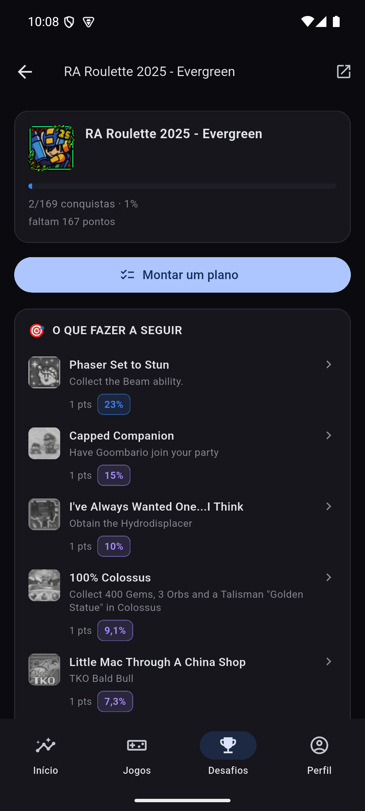
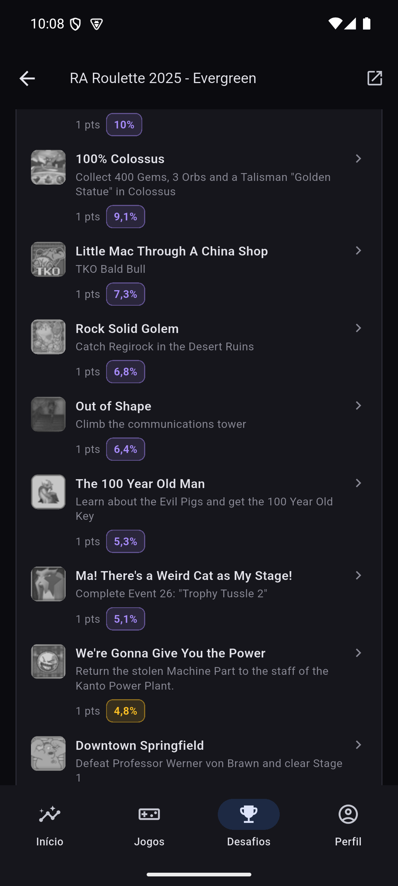

# Desafios

Os *events* do RetroAchievements (Achievement of the Week, RA Roulette,
Challenge League etc.) tratados como uma categoria própria em vez de
aparecerem misturados com jogos comuns.

> A Web API não tem um endpoint de events. O app chega neles do mesmo jeito
> que o site: acha o sistema "Events" via `API_GetConsoleIDs` e lista os
> "jogos" desse sistema com `API_GetGameList` — um event é, para a API, um
> jogo como outro qualquer.

## Lista

- **Busca** por nome do desafio.
- **Ordenação**: Mais perto (padrão, o mais próximo de terminar primeiro) ·
  Recentes · Maiores (por total de conquistas).
- **Filtros**: Todos · Em andamento · Não começados · Concluídos, cada um com
  a contagem ao lado.

O progresso de cada desafio não custa uma chamada por evento (seriam ~190):
sai do histórico de desbloqueios que o app já busca para outras telas
(agrupado por jogo), reaproveitado aqui.

## Detalhe — "O que fazer a seguir"

- Cabeçalho: progresso, pontos, quantas faltam.
- **"O que fazer a seguir"** lista as conquistas que faltam **ordenadas pela
  taxa de desbloqueio, da mais fácil para a mais difícil** — não pela ordem
  do jogo. A ideia é responder "por onde eu começo" sem precisar rolar o
  evento inteiro procurando o próximo passo óbvio.
- **"Ver todas as conquistas"** abre a ficha completa do evento (mesma tela
  de [Jogos](Jogos.md), porque para a API um evento é um jogo).

### O palpite de "você já joga esse jogo"

A API não liga a conquista de um evento ao jogo de origem — o texto é tudo
que existe (ex.: *"Great Wall of China - Simatai: Collect 30 rare items..."*).
Quando o app consegue extrair um nome de jogo do texto e ele bate com algo na
sua biblioteca, a linha ganha um selo:

- **confiança forte** — nome extraído bate exatamente com um jogo já jogado;
- **confiança fraca** — bate parcialmente (aparece com um ícone de
  interrogação, sinalizando que é palpite, não fato);
- **sem selo** — não deu para extrair nada com segurança; o app nunca inventa
  esse vínculo.

Esse casamento é só heurística de texto (`domain/insights/challenge_match.dart`)
— **se a API um dia expuser o vínculo real, é o único arquivo a trocar.**

### O que o app não automatiza

Events do RA não têm inscrição — e a Challenge League especificamente exige
postar no fórum para validar a participação. O rodapé da tela deixa isso
escrito porque a Web API é só leitura: postar no fórum ou se inscrever em um
evento não é algo que o app consiga fazer por você.

---
Próxima: [Perfil](Perfil.md) · Anterior: [Jogos](Jogos.md) · [Home](Home.md)
