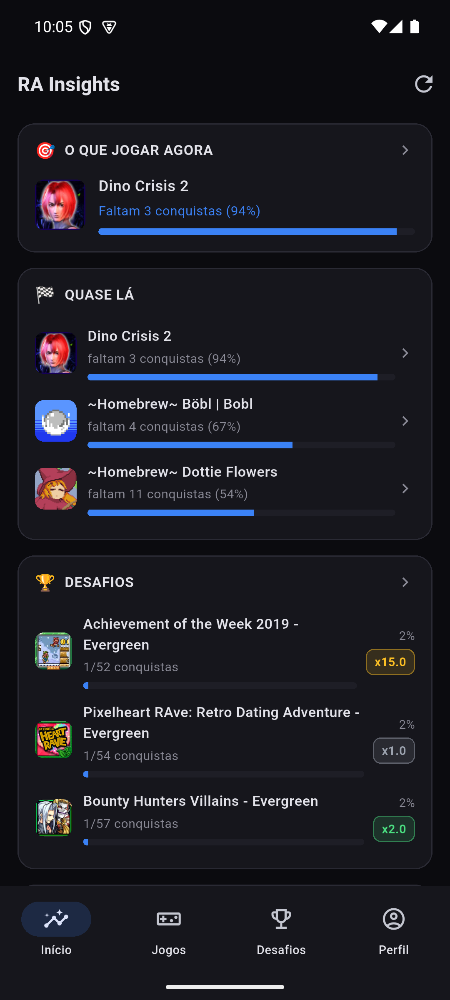
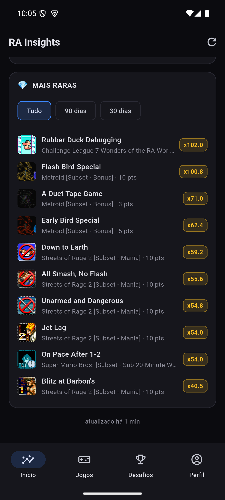

# Início (Dashboard)

A tela em que o app abre. Não é uma lista de jogos — é a resposta a "o que eu
faço agora", por isso os cards são recomendações, não um catálogo.

## Topo — O que jogar agora, Quase lá, Desafios

- **🎯 O que jogar agora** — uma única recomendação, não uma lista. O critério
  (`domain/insights/recommendation.dart`) favorece jogos perto da maestria,
  com poucas conquistas restantes e cujo trabalho restante não seja
  brutalmente raro (TrueRatio médio das conquistas que faltam). Toque abre o
  jogo direto.
- **🏁 Quase lá** — até 3 jogos com ≥50% e <100% de conquistas, ordenados por
  proximidade da conclusão. Cada linha tem barra de progresso e "faltam N
  conquistas (X%)".
- **🏆 Desafios** — prévia dos 3 events do RetroAchievements mais perto de
  terminar. Toque no cabeçalho do card leva para a aba **Desafios** inteira
  (não abre uma segunda tela por cima — troca de aba mesmo).

Todos os três cards carregam de forma independente: se um travar ou demorar,
os outros aparecem normalmente (cada um tem seu próprio provider e seu próprio
skeleton).

## Rolando — Mais raras

**💎 Mais raras** — as 10 conquistas mais raras da conta, por `TrueRatio`
(não por pontos — um item de 5 pontos pode ser muito mais raro que um de 50).
O multiplicador exibido (`x102.0`, `x71.0`...) é `TrueRatio / Pontos`.

Filtro de período: **Tudo · 90 dias · 30 dias**. Toque numa linha abre a
conquista diretamente na ficha do jogo (ou do event, se foi conquistada num).

## Banner offline

Se a última atualização falhar e ainda houver dados em cache, aparece uma
faixa "atualizado há X" no lugar de fingir que os números são atuais — o app
nunca mostra dado velho como se fosse novo sem avisar.

---
Próxima: [Jogos](Jogos.md) · Voltar: [Home](Home.md)
