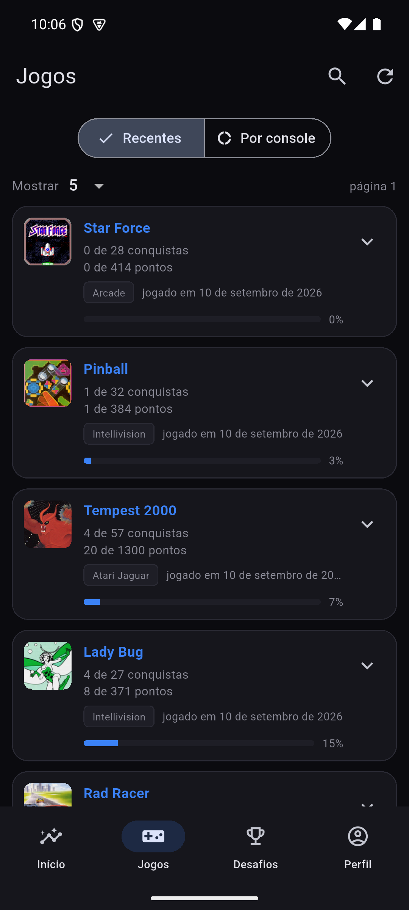
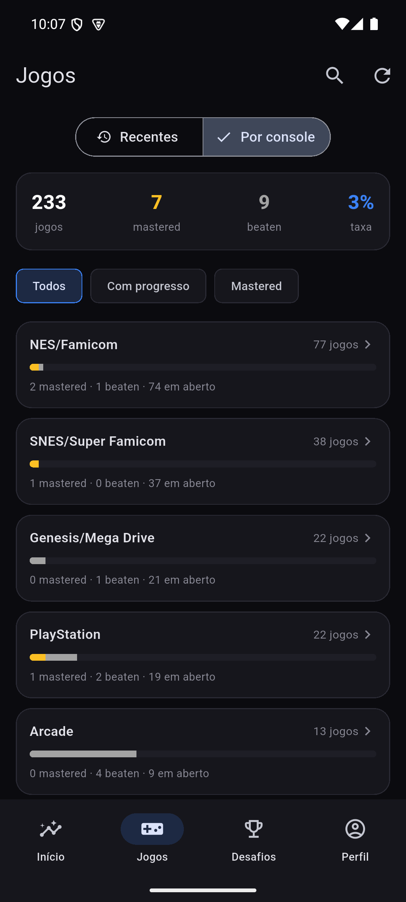
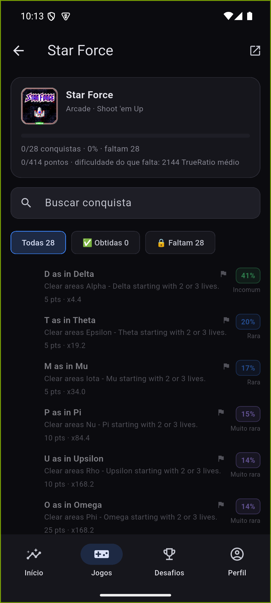
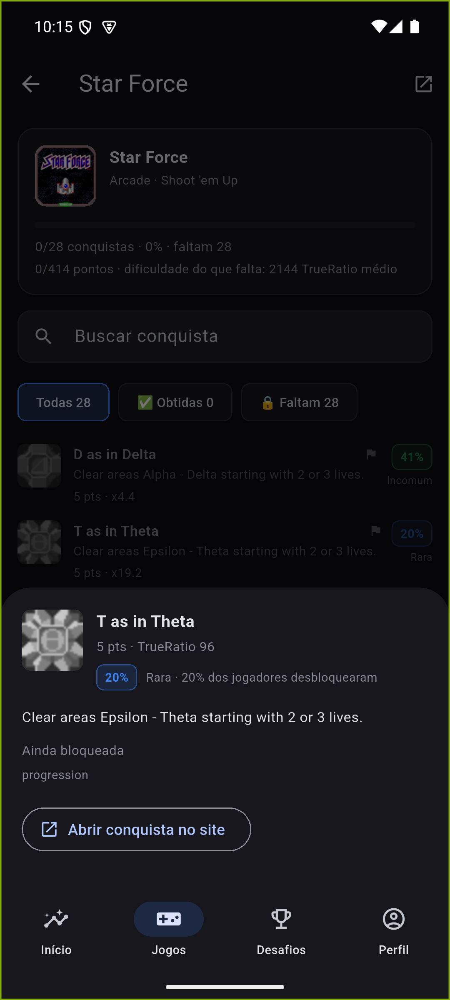

# Jogos

Um segmentado só, duas visões do mesmo dado (jogos da conta), porque as duas
antigas telas ("Recentes" e "Progressão") mostravam o mesmo tipo de
informação em formatos diferentes — juntar economiza uma aba inteira.

## Segmento "Recentes"

Os jogos jogados mais recentemente, com paginação ("Mostrar 5/10/25", "página
N") em vez de rolagem infinita — perfis grandes têm centenas de jogos, e
paginar evita carregar tudo de uma vez. Cada linha mostra plataforma,
"jogado em", pontos e uma barra de progresso; a seta (▾) expande a linha sem
navegar, para conferir o essencial sem sair da lista.

## Segmento "Por console"

- **Resumo no topo**: total de jogos, masteries, beaten e taxa de mastery da
  conta inteira — o mesmo cálculo que aparece no Perfil, só que aqui como
  ponto de partida para o drill-down por console.
- **Filtros**: Todos · Com progresso · Mastered.
- **Lista de consoles**, cada um com sua barra de progresso e a contagem
  mastered/beaten/em aberto. Toque num console abre a lista de jogos daquele
  console específico.

Essa tela existe para matar uma dívida técnica do projeto: antes ela dependia
de reprocessar o texto de um perfil no navegador (`scrapeConsoleBreakdown`);
hoje sai direto de `API_GetUserCompletionProgress` + `API_GetConsoleIDs`, sem
depender de nenhuma página carregada.

## Ficha do jogo

- Cabeçalho: ícone, gênero, progresso, pontos e **"dificuldade do que falta"**
  — o TrueRatio médio só das conquistas que ainda faltam, para responder "o
  que resta é fácil ou é osso".
- **Busca de conquista** — só aparece quando o jogo tem mais de 8 conquistas;
  abaixo de 8 ela seria mais atrito do que ajuda. Busca em título e descrição.
- **Filtros**: Todas · Obtidas · Faltam.
- Cada linha traz o selo de raridade (Incomum/Rara/Muito rara/Ultra rara,
  calculado a partir do `TrueRatio`) e o multiplicador exato.

## Bottom sheet de uma conquista

Toque em qualquer conquista, de qualquer lista do app, abre este mesmo
componente: pontos, TrueRatio, % de jogadores que desbloquearam, descrição e,
se ainda bloqueada, "Ainda bloqueada" + o tipo de progresso.

O botão **"Abrir conquista no site"** só aparece quando o próximo passo real
seria mesmo sair para o site externo. Quando a conquista pertence a um jogo já
carregado no app, tocar nela abre a ficha *dentro* do app em vez de mandar
para uma lista genérica — a régua é: só manda para fora se dentro não resolve.

---
Próxima: [Desafios](Desafios.md) · Anterior: [Início](Inicio.md) · [Home](Home.md)
