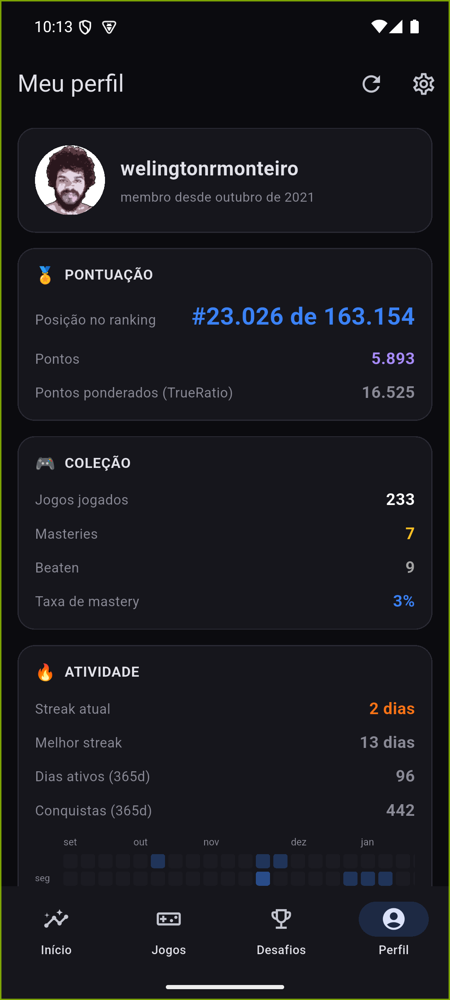
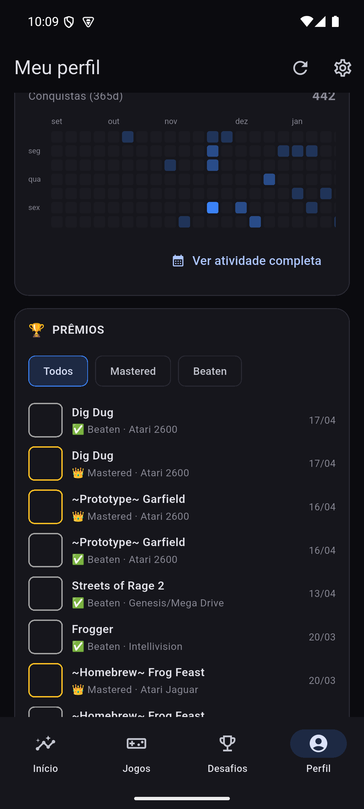
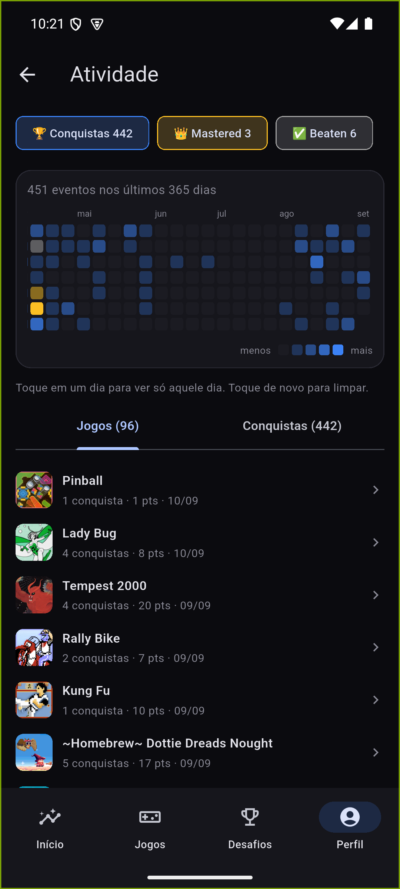
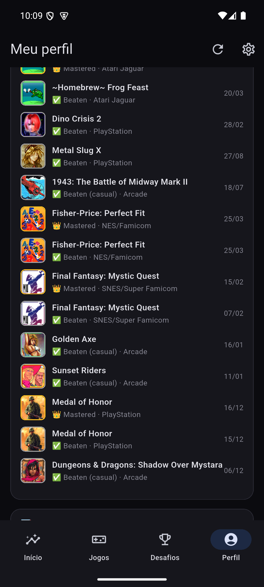
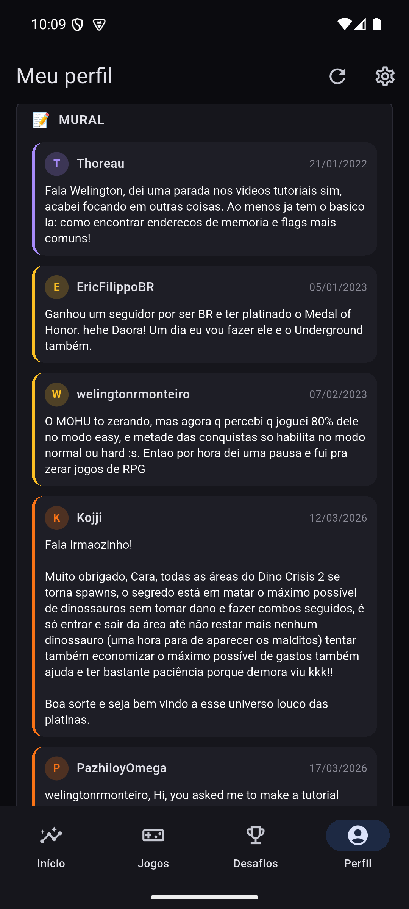

# Perfil

O retrato completo da conta. Reúne o que antes eram três abas separadas
(Perfil, Atividade, e os números que também apareciam duplicados no Início) —
ver esses números duas vezes em telas diferentes não ajudava ninguém, então
cada número mora num lugar só agora.

## Topo — identidade, Pontuação, Coleção, Atividade

- **Identidade**: avatar, nome de usuário, "membro desde".
- **🥇 Pontuação**: posição no ranking global, pontos, e pontos ponderados
  (TrueRatio) — a métrica que pesa raridade, não só quantidade.
- **🎮 Coleção**: jogos jogados, masteries, beaten, taxa de mastery.
- **🔥 Atividade**: streak atual, melhor streak, dias ativos e conquistas nos
  últimos 365 dias.

## Prévia da atividade e heatmap completo

A prévia mostra o final da grade de 365 dias; **"Ver atividade completa"**
abre a versão navegável:

- **3 modos combináveis**: 🏆 Conquistas · 👑 Mastered · ✅ Beaten — dá para
  ligar mais de um ao mesmo tempo; a prioridade de cor quando os modos se
  sobrepõem é `mastered > beaten > conquistas`.
- Toque num quadrado do calendário filtra a lista abaixo só para aquele dia;
  toque de novo limpa o filtro.
- Duas abas na lista: **Jogos** (agrupado) e **Conquistas** (cada unlock).

## Prêmios

Todas as masteries e beatens da conta, com filtro **Todos · Mastered ·
Beaten**. Cada linha tem a borda colorida (dourado para mastered, cinza para
beaten) e a data em que foi conquistado — o mesmo truque visual do resto do
app para reconhecer o tipo de cor sem precisar ler o texto.

## Mural

Os comentários do seu próprio mural do RetroAchievements, renderizados dentro
do app:

- **Links viram links de verdade** — texto sublinhado, tocável, abre num
  navegador embutido (Custom Tab) sem sair do app.
- **Link do YouTube toca embutido**, sem precisar do app do YouTube nem de um
  navegador — usa o player oficial em iframe. Se o dono do vídeo desativou a
  incorporação, o próprio player mostra o aviso do YouTube (isso é do vídeo,
  não um bug do app).
- **Link de imagem** (`.png`, `.jpg`, `.gif`, `.webp`) aparece como imagem
  inline, não como texto de URL.

---
Próxima: [Busca e Jogadores](Busca-e-Jogadores.md) · Anterior: [Desafios](Desafios.md) · [Home](Home.md)
